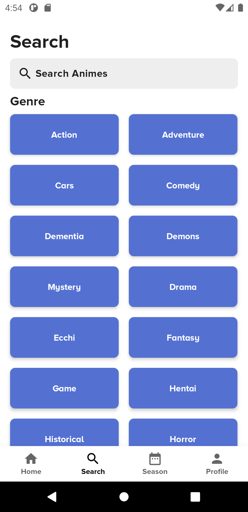
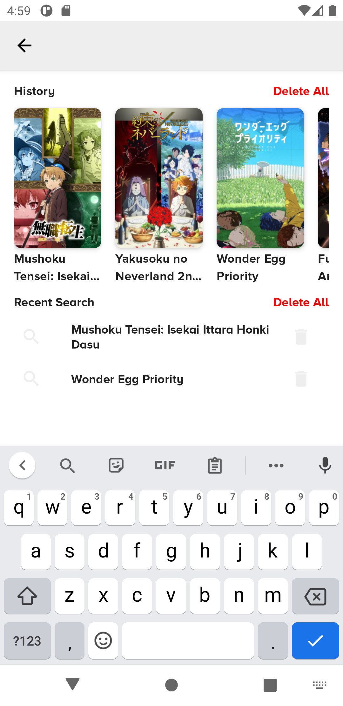

# Risuto

Risuto is my first android application that i build using Jetpack Compose
All of the anime data comes from [MyAnimeList](https://myanimelist.net/) and using [JikanAPI](https://jikan.moe/) for the REST API

# Preview
 </img> </img> </img>  
 </img> </img> </img>  

# Libraries

The libraries i use are: 
- [Jetpack Compose](https://developer.android.com/jetpack/compose/documentation)                                                                                                    
- [Hilt](https://dagger.dev/hilt/)
- [Room](https://developer.android.com/jetpack/androidx/releases/room?hl=id)
- [Retrofit](https://square.github.io/retrofit/)
- [Moshi](https://github.com/square/moshi)
- [Coil](https://coil-kt.github.io/coil/getting_started/)
- [Accompanist-Coil](https://google.github.io/accompanist/coil/) For coil image loading integration for jetpack compose
