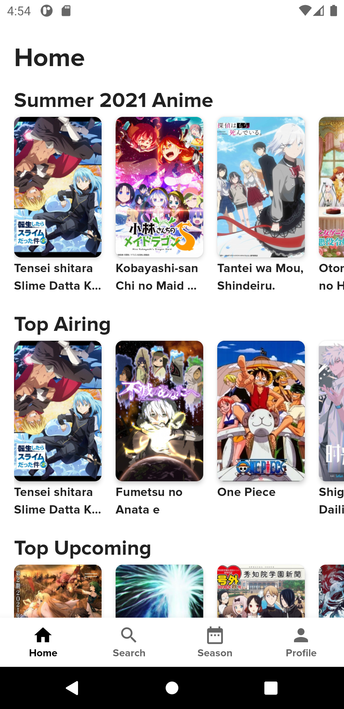
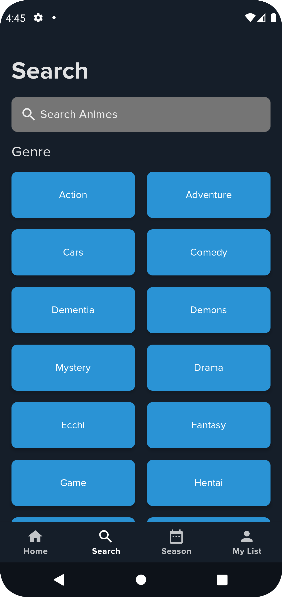
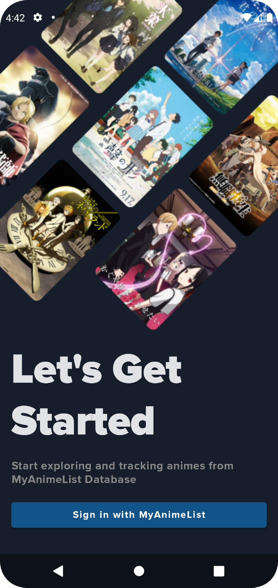
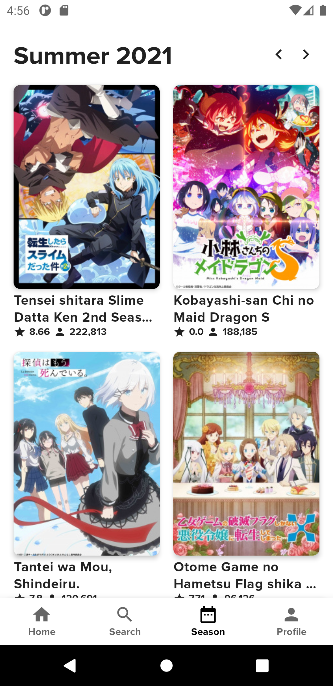
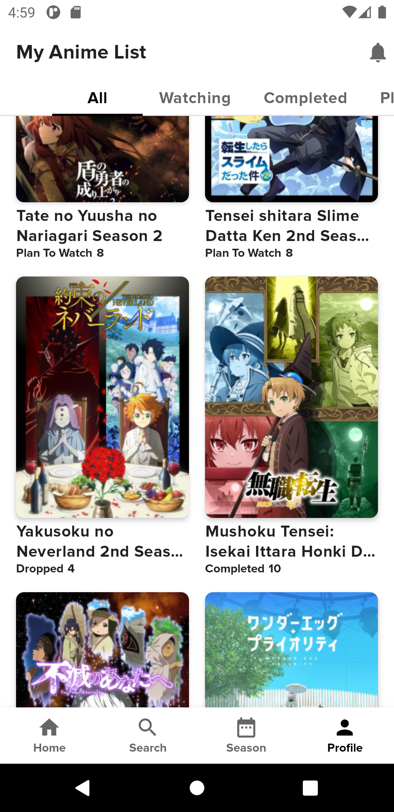

# Risuto

Risuto is my first android application that i build using Jetpack Compose which is easy to use and makes everything faster to develop.
The reason i build this app is to learn from the basics (ex: caching and rest api) to advanced things like dependency injection, multi-module structure, etc.
And also because althrogh i really like the website design, i didn't really like the official mal app ui design. So i want to make this app as beautiful as possible
All of the anime data comes from [MyAnimeList](https://myanimelist.net/) for anime detail and authentication with MAL account and using [JikanAPI](https://jikan.moe/) to call more data from MyAnimeList Website

# Preview
 </img> </img> </img>  
 </img> </img> </img>  

# Project Structure

This project is a multi module project and build with package by layer strategy. Which mean there are 3 main layer: data, domain, presentation. 
I learn it in ferPrieto spaceX project : https://github.com/ferPrieto/SpaceX-prepare-for-Clean-Architecture-liftoff

# Libraries

The libraries i use are: 
- [Jetpack Compose](https://developer.android.com/jetpack/compose/documentation)                                                                                                    
- [Hilt](https://dagger.dev/hilt/)
- [Room](https://developer.android.com/jetpack/androidx/releases/room?hl=id)
- [Retrofit](https://square.github.io/retrofit/)
- [Moshi](https://github.com/square/moshi)
- [Paging3](https://developer.android.com/jetpack/androidx/releases/paging)
- [Coil](https://coil-kt.github.io/coil/getting_started/)
- [Accompanist-Coil](https://google.github.io/accompanist/coil/)
- [Accompanist-Insets](https://google.github.io/accompanist/insets/)
- [Accompanist-FlowLayout](https://google.github.io/accompanist/flowlayout/)
- [Accompanist-SwipeRefresh](https://google.github.io/accompanist/swiperefresh/)
- [Splash-Screen](https://developer.android.com/guide/topics/ui/splash-screen)
